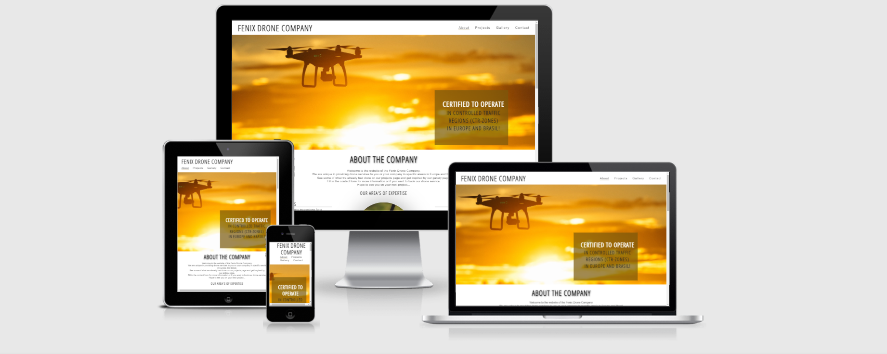

# Fenix Drone Company

Fenix Drone Company is a fictional website that is selling service of drone pilot in Europe and Brasil.
With expertise in Inspections, Mining, Geo-& Mapping and Film & Photography. Useful information such as certifications, type of drones and which projects are done will be shown on the website as well as a contact form and company information. This should give the user a comfortable feeling to book a drone project with Fenix Drone Company.

You can visit the deployed website [Here](https://ellis882.github.io/fenix-drone-company/)

---

## 1. UX

#### 1.1. Project Goals

The idea to come up with this project to make a website for drone services came because my partner is doing the certificates to become a drone pilot both in the Netherlands as in Brasil. At the moment this website is fiction but it could become real. With this project i hope to have a good base to build a custom made website in the future in different languages.

#### 1.2. User Stories

- As an owner of the company, I want to show what we already did and can do to gain more drone projects.
- As an owner of the company, I want to offer the possibility to give more information about the drone services we do.
- As an owner of the company, I want my website to be attractive and show the user that we are quilified to do specific drone  projects which requires expertise.

- As a user, I want to be able to get in touch with the company.
- As a user, I want to be able to check what they already did on projects and if they are quilified.
- As a user, I want to see rhe social media links to connect with the company.

- As a person needing a drone service for a special field of expertise, I want to be able to see what the company already did and with what type of equipmemt they work for my project to become a succes.
- As a regular customer, I want to get in touch with the company.
- As a potential client, I would like to see what the company can do and already did on projects.

#### 1.3. Design

-	The fact content that is shown on the website (such as the certifications and projects, gallery page) proofs ability that the drone service will be done in a professional way and that gives the user a confident feeling to book the drone service.

-	The color brown that is used throughout the pages will give the user a feeling of trust, comfort and reliability which is important if you want to book a service. It gives a trusting feeling. 
[had found this information](https://significadodeloscolores.com/nl/betekenis-van-bruine-kleur)

-	The image with zoom effect that is used on the about page is chosen because it looks as if the drone is flying towards the user. This is an interactive way of introducing the user with the company.

-	At the contact page, which is the last page, an image on the background with someone that controls a drone that flies away is chosen because it shows in the users mind that the contact form is sending to the company.

-	 The beginning and end images are especially chosen to give the user a signal of what the company represents. Goal is that the user is comfortable to book a drone service for a project with the company. Comfortable because the company is reliable, professional and good to work together with. The combination of colors and images that are used needs to come together to make a good users experience. The use of more images than text is chosen because good images says more than a lot of words and reach the emotional part of people. Which make them more willingly to ask more information or to book a drone service.
[Reading material to consider](https://resources.nuagency.com/blog/marketing/the-importance-of-images-in-marketing)

-	The simplicity of the website makes it easier for the user to find the information they want/need to know before booking a drone service. 

#### 1.3. Wireframes

I used [Balsamiq](https://balsamiq.com/) to create [WireFrames](https://github.com/ellis882/fenix-drone-company/tree/master/wireframes) in desktop, tablet and mobile view.

---

## 2.Features

### 2.1. Existing Features

- __Navigation Bar__
  - Featured on all four pages, the full responsive navigation bar includes links to the Logo, About page, Project page Gallery page and Contact page and is identical in each page to allow for easy navigation.
  - This section will allow the user to easily navigate from page to page across all devices without having to revert back to the previous page via the ‘back’ button. 

- __The landing page image__

  - The landing includes an image with text overlay to allow the user to see that Fenix Drone Company is certified to fly in CTR-Zones in Europe and Brasil. 
  - This section introduces the user to Fenix Drone Company with an eye catching animation to grab their attention. It looks that the drone is flying to you.

- __Expertise Section__

  - The Expertise section will inform the user to see in which area's the company operates. This is important to know for which type of projects they can book Fenix Drone Company. It shows the area's of expertise which is important if working with a drone.

- __Certifications section__

  - This section will show the user the competence of the drone pilot they want to hire for their project. It is important to know the rules to fly with a drone in the different countries. You need to be certified. Fenix Drone Company is certified to fly in Europe and Brasil. It shows the wide variety of the company. 
  - The insurance ,if something would happen during the flight with a drone, is also important to have. It reduces the financial consequences of the risk if something might happen during the project.
  - This section will be updated when more certifications are achieved. 

- __Equipment section__

  - This section will show the three different types of drones that are used during a project depending of the type of project.
   The drones have their own special features to make the job done in the best way with high quality. This gives the user a feeling of trust that their project will be a succes. Ofcourse the drone pilot makes the difference but you work faster and better with good equipment.

 - __Pricing section__

  - On the website we ask the user to contact us for a pricing. 
    There are many variables at play. It's so locolized and so different based on the specific market in the different counrties in Europe and in Brasil, that it's hard to give a fixed price. A lot of things are considered in the price like; the level of expertise, the industry, the insurance coverage, travel surcharges (is a job out of the regular service area), pricing-per-acre (for the specific industry) instead of per-hour and market value and ROI (what problems does Fenix Drone Company solves and how much is that worth)

- __The Footer__ 
 
  - The footer section includes links to the relevant social media sites for Fenix Drone Company. The links will open to a new tab to allow easy navigation for the user. 
  - The footer is valuable to the user as it encourages them to keep connected via social media. To ask the user to connect with us is a warm invitation on the end of every page.
  - There is also a top icon to go back easy to the top of the page.

- __The Projects Page__ 

  -This page shows some of the projects that Fenix Drone Company already did. It gives an idea to the user of what Fenix Drone Company is capable of and what type of drone services are provided.
  - On this page the user sees a picture of the project with a small description of the project.

- __The Promo statistics section__ 

  - This section will provide the user important information in a easy and fast way. It shows the facts, how many projects are really done by Fenix Drone Company, with how many partners they had worked. In this way you keep the user's interest and gain trust because they know what they can expect.

- __Gallery__

  - The gallery will provide the user with supporting images to see what projects are done. 
  - This section is valuable to the user as they will be able to easily identify the types of projects and in what expertise area's Fenix Drone Company operates and in which countries.
  - The look and feel of this page is to make the user want to book a drone service with the Fenix Drone Company.

- __The Contact Page__

  - This page will allow the user to get in contact with the Fenix Drone Company. They can send a message to make an appointment or ask information. The user will be asked to submit their full name and email address and if they are in Europe or Brasil. 

 ### 2.2. Features Left to Implement

  - Plan is to make the website in a multi languages site because of the different countries we operate. Need to do research of what and how the best way is, to do that. Maybe it is better to make a total different one in context of custom building.
  - contact the user when the had send a message in contact form

  ---

 ## 3. Technoligies used

- [HTML5](https://en.wikipedia.org/wiki/HTML5)
HTML5 was used to make the structure of the website

- [CSS3](https://en.wikipedia.org/wiki/Cascading_Style_Sheets)
CSS3 was used to add style to the website

- [Googlefonts](https://fonts.google.com/)
Google fonts was used to import "Oswald en Open Sans Condensed" as font family for the website

- [FontAwesome](https://fontawesome.com/)
Font Awesome was used to add icons to the website for styling of the website

- [Gitpod]((https://gitpod.io/)
used to develop the website

- [Github](https://github.com/)
Github is used to store/host the project

- [Balsamiq](https://balsamiq.com/) 
used to create the project's wireframes

- [Am I Responsive?](http://ami.responsivedesign.is/)
used to show in a quick visual way the responsiveness of the site

---

## 4. Testing 

### 4.1. Code Validators

-[HTML Validator About](https://github.com/ellis882/fenix-drone-company/blob/master/readme.files/html-validator-about.pdf)
No errors just had put &amp instead of &amp; that was solved right away

-[HTML Validator Projects](https://github.com/ellis882/fenix-drone-company/blob/master/readme.files/html-validator-projects.pdf)
No errors found
In my HTML i had add style at the images for "height:auto;width:100%;" to avoid error. 

-[HTML Validator Gallery](https://github.com/ellis882/fenix-drone-company/blob/master/readme.files/html-validator-gallery.pdf)
One warning about section lacks heading, but this was a design choice

-[HTML Validator Contact](https://github.com/ellis882/fenix-drone-company/blob/master/readme.files/html-validator-contact.pdf)
No errors found

-[CSS Validator](https://github.com/ellis882/fenix-drone-company/blob/master/readme.files/css-validator.pdf)
No errors found

### 4.2. Responsiveness

- To test the responsivness of the site i used [Chrome DevTools](https://developer.chrome.com/docs/devtools/) and lighthouse on desktop [Lighthouse desktop](https://github.com/ellis882/fenix-drone-company/blob/master/readme.files/lighthouse-desktop%20(1).pdf) and on mobile [Lighthouse mobile](https://github.com/ellis882/fenix-drone-company/blob/master/readme.files/lighthouse-mobile%20(1).pdf)

### 4.3. Testing User Stories

- As an owner of the company, I want to show what we already did and can do to gain more drone projects.
  - on the about page you can see the amount of certificates and insurance that is needed to do a drone project and the area's of expertise of the company.
  -on the projects page you see the projects already done and the promo statistics which give a clear view what the company already had accomplished.

- As an owner of the company, I want to offer the possibility to give more information about the drone services we do.
  - the contact page will give the user a possibility to send a message for more information about pricing or specific projects.
  - The footer will provide the links to connect on Social Media and there you will find more information about the drone services.

- As an owner of the company, I want my website to be attractive and show the user that we are quilified to do specific drone  projects which requires expertise.
  - The landing page with zoom effect will make the website more atractive because it looks as if the drone is flying. The About page provides all the information the user wants to know before booking a drone service for a specific expertise area.
  - The Gallery page gives a nice look and feel of the projects.
  - The Projects page shows that the company already did some succesful projects and that gives a feeling of trust.  

- As a user, I want to be able to get in touch with the company.
  - Through the contact form you can get in touch with the company or you can call because the company details are on the contact page too.

- As a user, I want to be able to check what they already did on projects and if they are quilified.
  - On the Projects page you can see the different projects and a promo statistics for the facts.
  - On the Gallery page you see a nice overview of pictures of the projects.
  - On the About page you will found the certificates of the company and the type of drones they use for the different projects.

- As a user, I want to see rhe social media links to connect with the company.
  - In the Footer you can see the links to connect with the company.

- As a person needing a drone service for a special field of expertise, I want to be able to see what the company already did and with what type of equipmemt they work for my project to become a succes.
  - All this type of information is provided on the About page and the Projects page.

- As a regular customer, I want to get in touch with the company.
  - To get in touch you can connect through Social Media links or to fill in the contact form. The company will contact you to answer your questions or to see which drone project they can do. 

- As a potential client, I would like to see what the company can do and already did on projects.
  - This information you see right away on the statistics promo on the Projects page.

### 4.4. Bugs

- One of the major bugs I found during the development process was to set the outline of my promo statistics section on the projects page. Could not outline them good. I had solve that by setting the width and margin property different.

- Another bug that i found was that the images of the projects section were to big and overflowing on smaller screens. Had solve that to make an scroll function when overflowing with the media queries.

---

## 5. Deployment 

**To deploy the project**

- The site was deployed to GitHub pages. The steps to deploy are as follows: 
- In the GitHub repository, navigate to the Settings tab 
- From the source section drop-down menu, select the Master Branch
- Once the master branch has been selected, the page will be automatically refreshed with a detailed ribbon display to indicate the successful deployment. 

The live link can be found here -  (https://ellis882.github.io/fenix-drone-company/)
**To clone the project**

- Under the repository’s name, click **Clone or download**.
- In the **Clone with hTTPS** section, copy the given URL.
- In your IDE of choice, open **Git Bash**.
-  Change the current working directory to the location where you want the cloned directory to be made.
- Type **git clone**, and then paste the URL copied from GitHub.
- Press **enter** and the local clone will be created.

---

## 6. Credits 

In the content section you can find all the sources were i got my information from. I had used a lot of google serach to get the information i needed for my website and to solve difficulties while making the website. 

### 6.1 Content 

- The text for the Expertise- and Projects section and a bit for the Certifications list was taken from the website of the [Dutch Drone Company](https://www.dutchdronecompany.com/)

- For the certifications list, information was taken from the website [Drone Flight Academy](https://www.droneflightacademy.eu/)

- Text for the drones we use was taken from a search on google to see which drones are used in the area's of expertise. Matching images where taken from [Unsplash, free images](https://unsplash.com/)

- Idea for Gallery page on how the images are set up and Landing Page zoom effect with overlay text was inspired by the Love Running Project at Code Institute in LMS.

- Instructions on how to implement form validation on the Contact page was taken from Code Institute in LMS [specific from the Love Running project](https://www.codeinstitute.net)

- The icons in the footer were taken from [Font Awesome](https://fontawesome.com/)

- Idea of a promo statistics section was taken from [w3 Schools, specific from the templates files](https://www.w3schools.com/w3css/tryw3css_templates_startup.htm)

- Pricing is a tricky part because there are a lot of things to consider for making a price. Information to consider i took from [DroneLife](https://dronelife.com/2017/05/31/professional-operators-price-drone-services/)

### Media

- The photos/ Images used on the website are all taken from Unsplash, Free Images. Because the website is fiction i had no acces to video or real images. If the website was real i would use short video's of the projects that were done by the company and different images of the drones we use and gallery page. Now i had used images for the look and feel of the company.

- Videos for drone users i watched to get inspired [youtube](https://youtu.be/v0TeCv4eqyc)

### Acknowledgements

- My Mentor for continuous helpful feedback.

